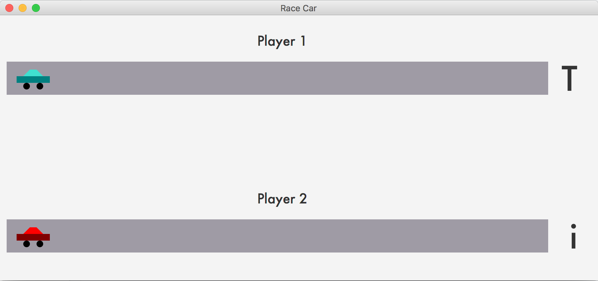

# Java-Car-Game

## Synopsis
This is a 2 player typing game. The "Demo" version has each player using 4 keys while the "Full" version requires the use of all letters. 

## Motivation
This is a demonstration of a GUI program for presentation purposes. This program uses JavaFX.

## How to Play
To play, connect 2 keyboards to the computer. To distinguish between Player 1 and Player 2, make sure the Player 1 keyboard has Caps Lock on. To restart during the game, press the "Esc" button. To restart after game completion, press the space bar.


## Code Example
This code snippet is how the program determines what key is pressed and when end-of-game occurs.
```
keyHandler = new EventHandler<KeyEvent>() {
  @Override
  public void handle(KeyEvent e) {
    // If player hits the a letter key (and for player 1 is capitalized) send
    // to respective player function to determine moving forward or backward
    if(e.getText().equals(e.getText().toUpperCase()) && e.getCode().isLetterKey()) {
      testCar1(e);
    }
    else if (e.getCode().isLetterKey()) { 
      testCar2(e);
    }
				
    // If player 1 triggered end-of-game, display results and new game option
    if (car1.isOver){
      scene.removeEventHandler(KeyEvent.KEY_RELEASED, keyHandler);
      if (car1.didWin) {
        score.setText("Player 1 won! : )");
      }
      else {
        score.setText("Player 1 lost : (");
      }
      restart.setText("Press Space to Start a New Game");
      scene.addEventHandler(KeyEvent.KEY_RELEASED, spaceHandler);
    }
    // If player 2 triggered end-of-game, display results and new game option
    else if (car2.isOver) {
      scene.removeEventHandler(KeyEvent.KEY_RELEASED, keyHandler);
      if (car2.didWin) {
        score.setText("Player 2 won! : )");
      }
      else {
        score.setText("Player 2 lost : (");
      }
      restart.setText("Press Space to Start a New Game");
      scene.addEventHandler(KeyEvent.KEY_RELEASED, spaceHandler);
    }
  }
};
```
